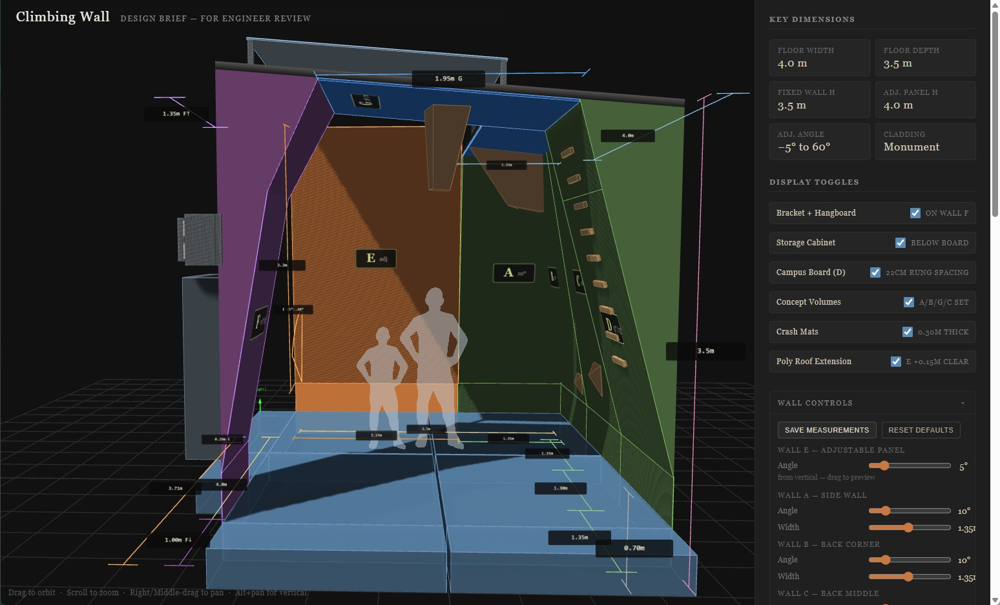

# Home climbing wall concept

Interactive 3D concept planner for a backyard climbing wall. The app lets you adjust wall angles, panel dimensions, roof pitch, mats, and camera position to validate geometry before building.

## Live site

[wall.deantimson.com](https://wall.deantimson.com/)

## Run locally

Open [index.html](./index.html) directly in your browser.

## Quest 2 VR preview

- Serve over `https://` (for example [wall.deantimson.com](https://wall.deantimson.com/)).
- Open the page in Quest Browser and click **Enter VR**.
- Movement in VR:
  - Room-scale headset movement for true 1:1 scale.
  - Left thumbstick locomotion to move around the wall.

## Edit all textures in one image

You can pack all wall + volume textures into one editable atlas, then split it back.
Atlas workflows are now per wall design (`classic`, `variantB`, etc.):

```powershell
scripts\individual-to-atlas.bat -DesignId classic
scripts\atlas-to-individual.bat -DesignId classic
```

Generated files:

- `textures/designs/<designId>/texture-atlas.png` (edit this)
- `textures/designs/<designId>/texture-atlas.manifest.json` (used for slicing back)

Optional: include bump maps in the atlas too:

```powershell
powershell -ExecutionPolicy Bypass -File scripts/individual-to-atlas.ps1 -DesignId classic -IncludeBumps
```

## Screenshot


